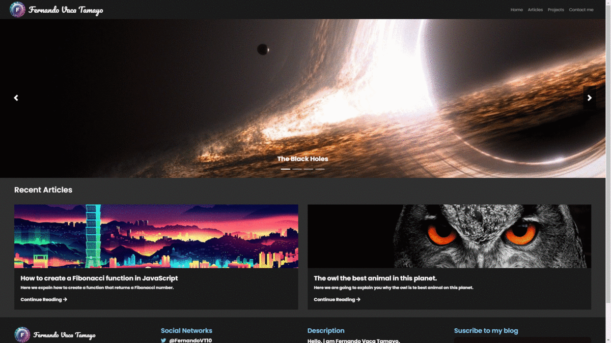

## My Personal Blog
This is the code for my personal blog created with **React JS**, **Next JS**, **Node JS**, **Express** and **MongoDB**.

### Freatures
* An article system
* A project system
* A message system
* An article traffic analysis system
* A dashboard with article, projects and messages management
### Running
1. Clone the repository
2. Run `npm install`
3. Clone or rename the `.env.example` file to `.env` and set the necessary data
4. Run the mongoDB Server
5. Run `npm run seed` to seed the database
6. Run `npm run build`
7. Run `npm start`
8. Go to `http://localhost:3000`

**Note**: To enter the administration dashboard you need go to `http://localhost:3000/admin` and login with the username: `admin` and password: `admin`.